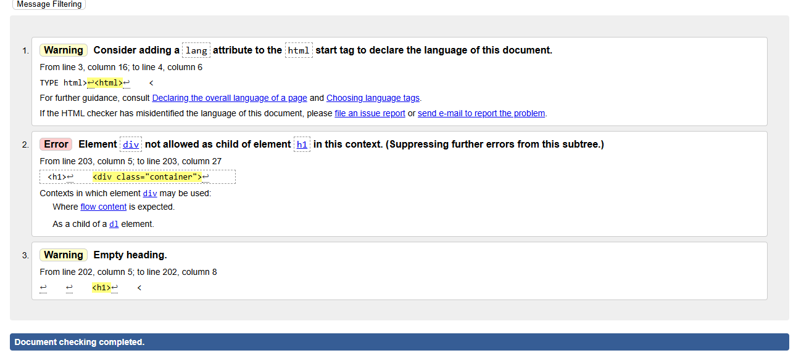
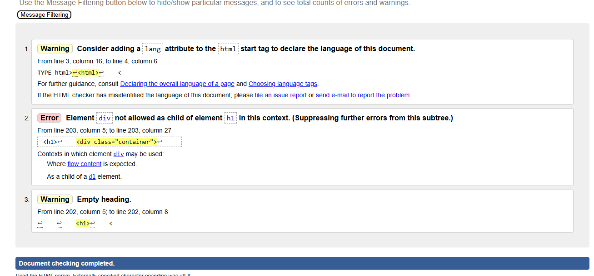
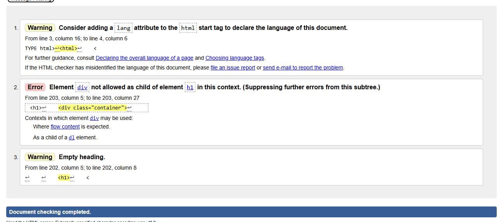

# Errors in Validation

> The following errors (see screenshot), I couldn't find these errors in the html.

1. The pages extend base.html, but the error is shown saying I need "!doctype html".
2. This shows that I have a div element as a child of h1 however looking through the code I did not find this.
3. This is telling me I have an empty h1. I also could not see this.  

- add product page

- edit product page

- delete product page

